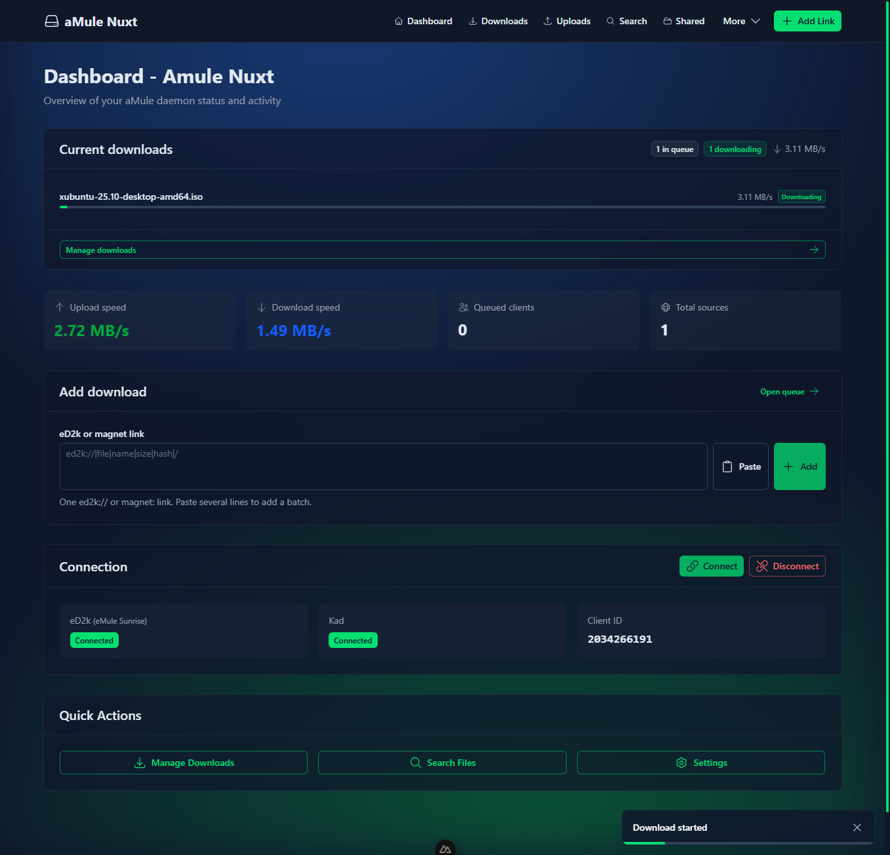
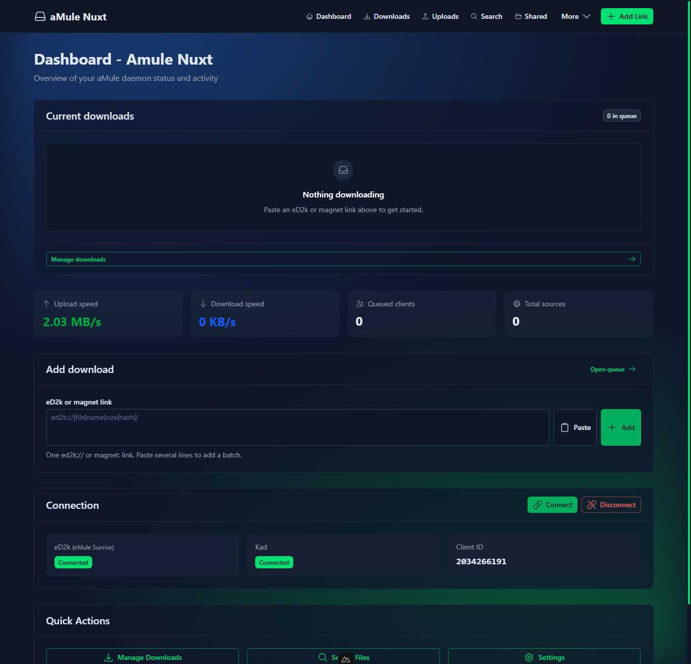
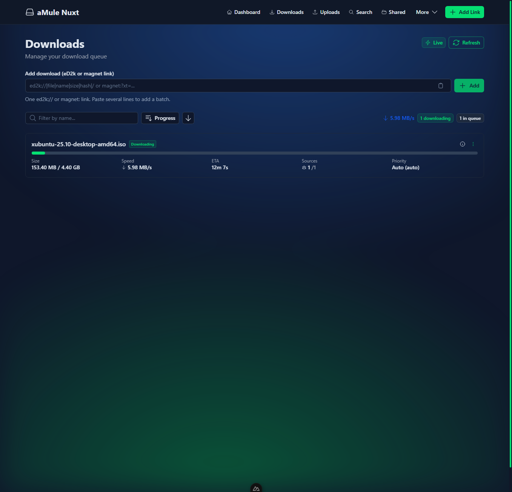
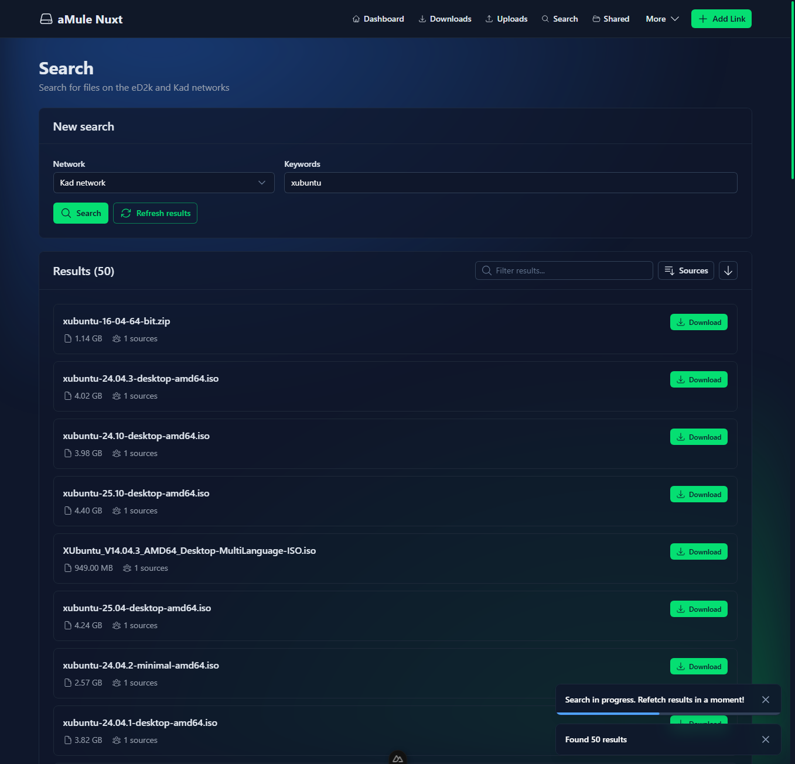
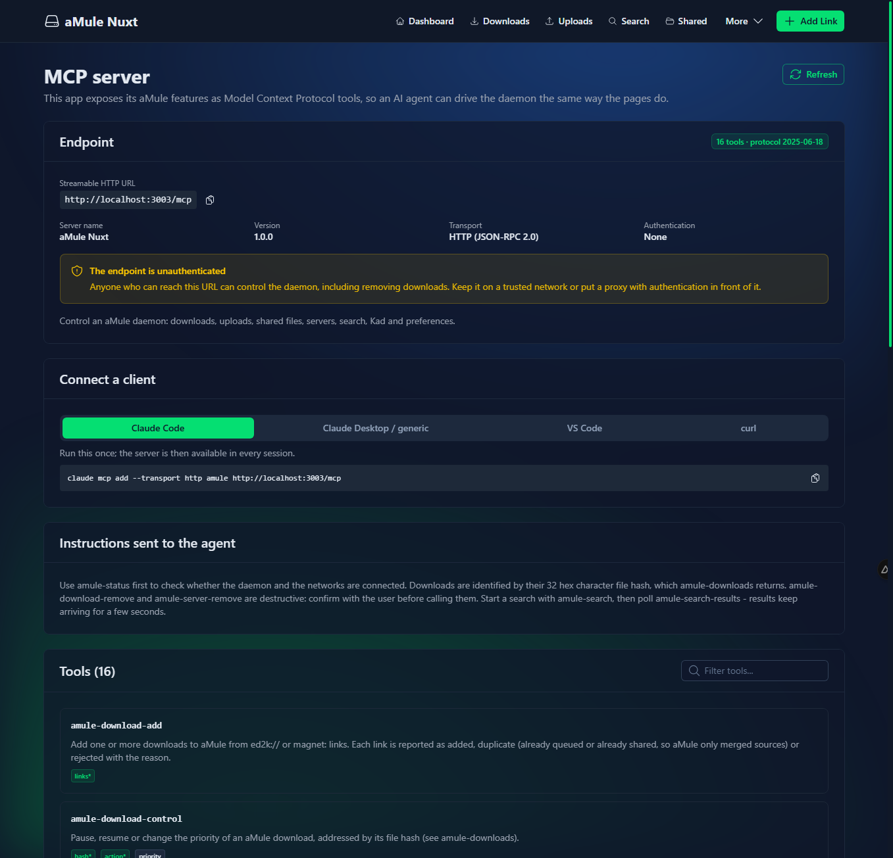
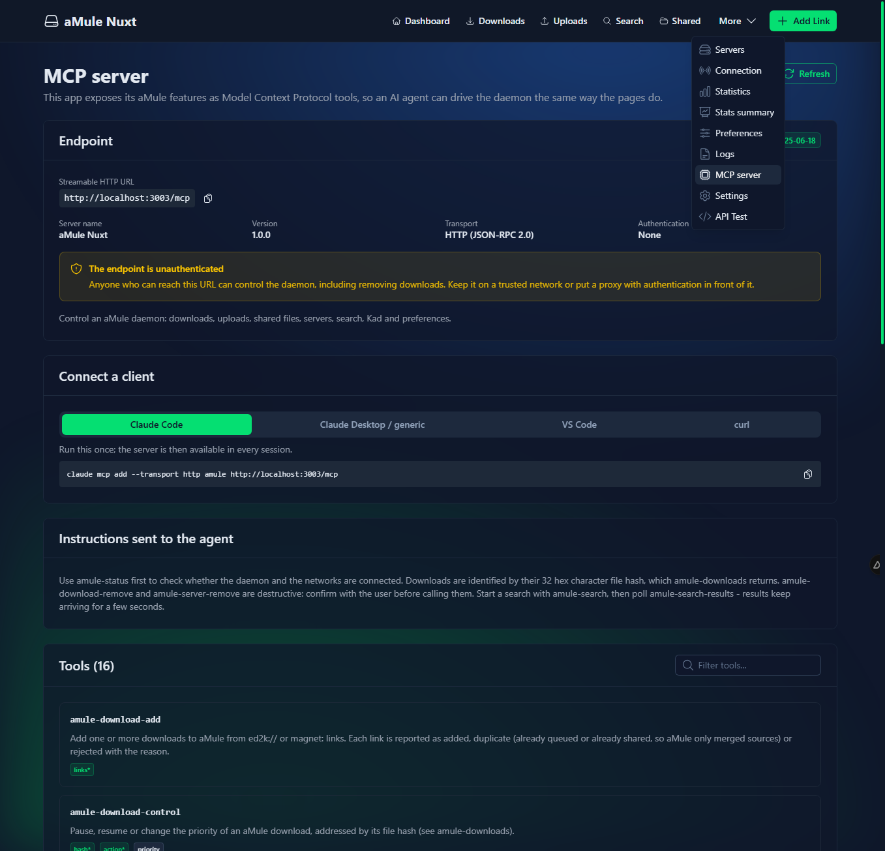
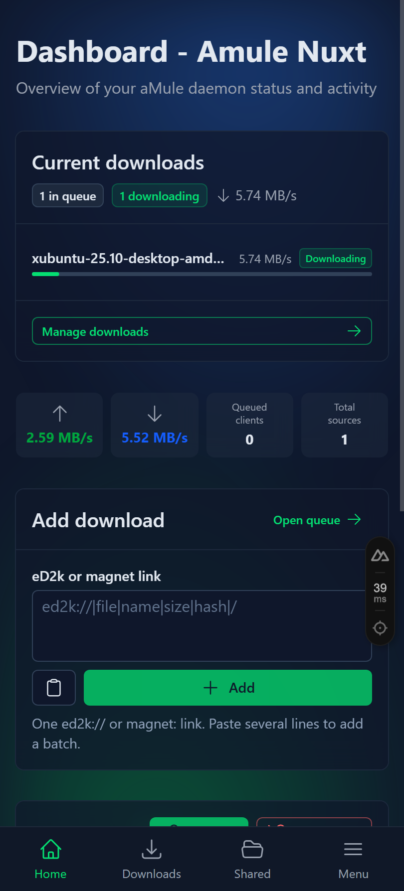
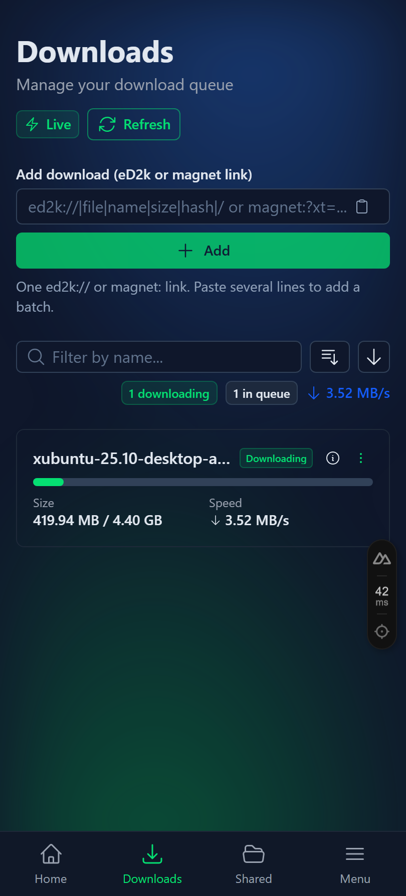
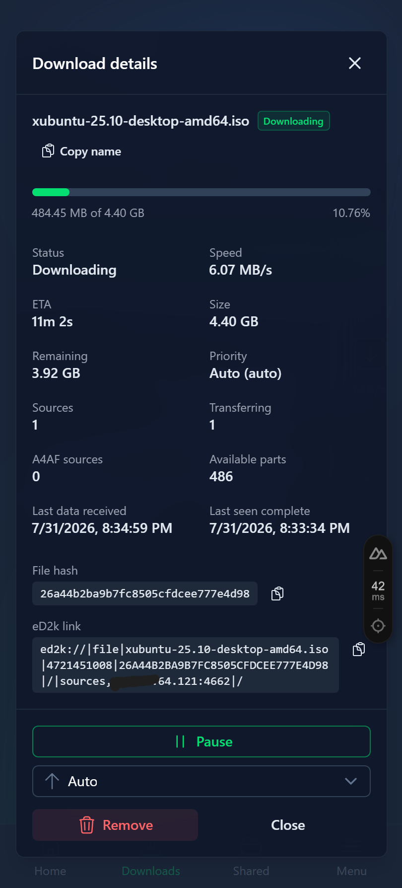
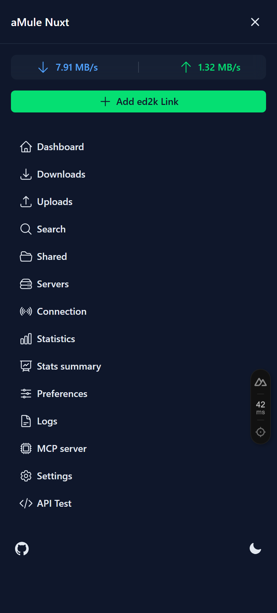

# aMule Nuxt

[](https://github.com/JuanmanDev/amule-nuxt/releases/latest)
[](https://github.com/JuanmanDev/amule-nuxt/actions/workflows/ci.yml)
[](https://github.com/JuanmanDev/amule-nuxt/actions/workflows/release.yml)
[](https://github.com/JuanmanDev/amule-nuxt/actions/workflows/docker.yml)
[](https://github.com/JuanmanDev/amule-nuxt/pkgs/container/amule-nuxt)
[](CHANGELOG.md)




A modern web interface **and MCP server** for an [aMule](https://amule.org) daemon, built with **Nuxt 4**, **Nuxt UI 4** and **TypeScript**.

It speaks aMule's native **External Connection (EC) protocol** directly — a TypeScript implementation living in this repository, no `amulecmd` binary required — so it runs anywhere Node runs and can drive a daemon on another machine.

```
┌──────────────┐   HTTP/JSON   ┌────────────────────┐   EC protocol   ┌──────────────┐
│  Vue pages   │ ────────────► │  Nitro API + MCP   │ ──────────────► │ amuled       │
│  (Nuxt UI)   │ ◄──────────── │  server            │ ◄────────────── │ (TCP 4712)   │
└──────────────┘   WebSocket   └────────────────────┘                 └──────────────┘
```

## Highlights

- **Complete daemon control** — downloads, uploads, shared files, search, servers, Kad, preferences
- **Autonomous search** — the server re-runs your keywords every 5 minutes for an hour, a day, a week, a month or until stopped, cycling Kad and eD2k and merging every pass into one deduplicated list — so files on machines that were offline earlier keep turning up
- **MCP server built in** — 19 tools on `/mcp`, so an AI agent can drive aMule exactly as the UI does
- **A local AI assistant** — a language model that runs *in the browser* on WebGPU and drives aMule through those same MCP tools; the conversation never leaves the machine
- **Speaks 38 languages** — the 37 aMule itself ships, plus English, chosen per device and rendered server-side
- **Tells you when downloads start and finish** — in the page, as an OS notification, and over Web Push with no tab open at all
- **Paged lists** — 100 rows at a time by default with a per-page selector, so a queue of thousands stays as fast as a queue of ten
- **Real EC protocol client** — opcodes and tags mirrored from aMule's own headers, UTF-8 safe, verified against a live daemon
- **Honest UI states** — every page starts in a loading state, explains *why* something is not progressing, and never claims success the daemon did not confirm
- **Handles `ed2k:` and `magnet:` links** from the operating system, with a confirmation step
- **Live updates** over WebSocket, with polling as a fallback, and a background that reacts to real traffic
- **Motion that means something** — rows animate in and out as the queue changes, live figures crossfade instead of snapping, translucent blurred surfaces let the activity background through, and everything is switched off under `prefers-reduced-motion`
- **Cheap by default** — the background is a static tint unless you ask for the drifting shapes, and both it and the frosted panels can be turned down in Settings when the GPU has better things to do
- **Well tested** — unit tests for the protocol and helpers, Playwright end-to-end tests driving a real daemon, CI on every push

## Pages

| Page | What it does |
|------|--------------|
| `/` | Dashboard: queue summary, live speeds (clickable), add form, connection state |
| `/downloads` | Queue with progress, ETA, sources, health badges, details modal, pause/resume/priority/remove |
| `/uploads` | Who is downloading from you: file, address, client software, speed, session and all-time bytes, queue position |
| `/shared` | Every shared file with requests, accepted requests, bytes sent, share ratio, queued clients, details modal |
| `/search` | Kad / eD2k / local search on one row, searches kept in tabs for a week, results split by what you already have, and a details view per result |
| `/search-auto` | Autonomous search: the server repeats a search every 5 minutes for a chosen time span (or until stopped), alternating networks and accumulating deduplicated results — no browser needed |
| `/assistant` | A language model running entirely in this browser that can answer questions about the daemon and operate it |
| `/servers` | Server list with connect, add, remove, plus server-list preferences and "update from URL" |
| `/connection` | eD2k and Kad state, connect/disconnect, Kad start/stop/bootstrap/nodes.dat, server message of the day |
| `/statistics` | Animated rate chart with server-side history, session **and** all-time totals, and aMule's full statistics tree |
| `/stats` | Compact statistics summary |
| `/preferences` | Nickname, bandwidth and connection limits, ports, directories |
| `/logs` | Daemon log with filter, newest-first toggle, highlighted warnings |
| `/settings` | Bandwidth limits, background and glass appearance, link-handler registration, runtime diagnostics |
| `/mcp-server` | Live documentation of the MCP endpoint and its tools |

Pages that overlap link to each other: a short **Related pages** section at the foot of each page points where you would likely go next — the two statistics views at each other, servers at connection, search at its autonomous sibling.

Every list page shares the same controls: a filter that grows to fill the row, a compact sort menu that collapses to an icon on small screens, and an ascending/descending toggle for every sort field. Lists animate their additions and removals, and figures that change while a page is open (speeds, counts, badges) crossfade with a brief highlight. On a phone the download rows drop the ETA column so the stats stay on one line.

Long lists are paged: 100 rows at a time by default, with a per-page selector (25 to 500, or all) that is remembered per list on the device. Filtering and sorting always run over the whole list, never over the page you happen to be on, and turning a page does not animate — a hundred rows leaving while a hundred others arrive is not a change anyone made.

### Selecting several rows

Downloads, uploads and shared files each have a **Select** button that turns the list into a set of checkboxes and opens an action bar. Selecting is off until asked for, because a list of checkboxes makes the ordinary case — click a row, read it — worse.

- **Select all** means every row matching the current filter, not every row on the page. Which page happens to be open must never change what Remove does.
- Downloads can be **paused, resumed or removed** in bulk. The commands run one after another, because the daemon serves a single EC connection, and report once at the end rather than once per file.
- Every list offers **Totals** — what the selection adds up to, which is the question a selection is usually about: how much is left, how fast is all of this going, how much have I sent — and **the eD2k links** for everything picked, shown as text as well as copied, since a clipboard write is refused on a plain-HTTP origin.
- Uploads cannot be paused or cancelled: aMule's protocol exposes no way to control an individual upload. Their links are resolved through the shared files, which hold the size an upload does not carry.

Removing is confirmed with the number of files and the bytes that will be deleted. A row that disappears while selected drops out of the selection, so a bulk action never runs against a hash the daemon no longer has.

### Languages

The interface is translated into the same 37 languages aMule itself ships, plus English. Pick one from the globe in the footer or the mobile menu; the choice is stored in a cookie so the *server* renders the right language on the next request, with no flash of English.

Translations fall back key by key, so a language that has not caught up with a new screen shows English for those strings only. `npx vitest run test/locales.test.ts` prints exactly how complete each language is, and checks that every translation keeps the placeholders and plural forms of the English original.

### Searches

aMule holds exactly one search: starting another throws the previous results away, and nothing survives a restart. Kad queries take the better part of a minute to settle, so results are worth keeping — and they are kept **on the server**, for seven days:

- reloading the page keeps them, and so does opening the app in another browser or on the phone;
- each search is its own tab; only the newest can be refreshed, because it is the only one aMule still knows about. Older tabs say when their snapshot was taken and offer to run the keywords again;
- a search that returned nothing is not stored — an empty tab that cannot be resumed is only clutter.

Results are split by what this daemon already knows about each file hash: **not added yet**, **in the queue**, **already here**. Each group carries its count, so a search for something you have been collecting can be narrowed to just the files you are missing. Bounded, because the store is a JSON file: 20 searches, 500 results each, seven days.

### Download notifications

The server watches the queue itself, so a download added from another machine, from amuleGUI, or by an `ed2k:` link handler is announced here too — not only the ones started in this browser. There are two layers, and Settings turns each on or off:

- **In the page**: a toast with a link to the queue, plus an operating-system notification when the tab is not the one on screen. Needs nothing but an open tab.
- **Web Push**: a service worker receives the same events with the app closed entirely. It needs notification permission and a secure origin (HTTPS, or `localhost`), and a *Send a test* button proves the whole chain in one click.

Because aMule's protocol reports neither, this app also records **when each download started and when it finished** and shows both in the details view. A download that was already queued the first time the app looked says "in the queue since" rather than claiming a start time nobody observed.

### The local assistant

`/assistant` runs a language model in the browser with [WebLLM](https://github.com/mlc-ai/web-llm) on WebGPU. The model is downloaded once (0.9–5 GB depending on which you pick) and cached by the browser; after that it runs offline. Nothing you type is sent anywhere.

It operates aMule through this app's own MCP endpoint — the same 19 tools external agents get — so anything the interface can do, it can do, and a tool added there appears in the assistant with no further work. Tools published by the page through the draft WebMCP API (`navigator.modelContext`) are picked up as well when a browser supports it. Every tool call is shown in the transcript and can be expanded to see exactly what was sent and what came back.

WebGPU is required: Chrome, Edge and Opera have it on the desktop today. Elsewhere the page says so instead of failing.

---

## Connecting to aMule

The app never touches aMule's files; it only needs the External Connection interface, which every `amuled` and `amule` build supports.

### A. You already run an aMule daemon

1. Enable external connections in `~/.aMule/amule.conf` (create the keys if missing):

   ```ini
   [eMule]
   AcceptExternalConnections=1
   ECPort=4712
   # MD5 of your chosen password
   ECPassword=5f4dcc3b5aa765d61d8327deb882cf99
   ```

   Compute the hash with `printf '%s' 'your_password' | md5sum` (Linux) or `md5 -q -s 'your_password'` (macOS).

2. Restart the daemon so it picks the settings up: `amuled --restart` or restart your service.

3. Point this app at it:

   ```bash
   cp .env.example .env
   # AMULE_EC_HOST=192.168.1.50     # host running amuled
   # AMULE_EC_PORT=4712
   # AMULE_EC_PASSWORD=your_password   (plain or the MD5 hash - both work)
   npm install && npm run dev
   ```

4. Check the wiring: `npm run amule:test`, or open `/settings` which shows the host, port, server mode and log level.

If the daemon listens only on loopback, either run this app on the same host, or set `ECAddr=0.0.0.0` in `amule.conf` and firewall port 4712 to your network.

### B. You want a fresh daemon

**Docker, everything in one go** — the compose file starts `amuled` and this app together:

```bash
cp .env.example .env      # set AMULE_EC_PASSWORD
docker compose up -d
# UI on http://localhost:3000, live updates on 3001, daemon EC on 4712
```

Already have a daemon, or want the two apart? See
[Docker Compose — three layouts](#docker-compose--three-layouts).

**On the host:**

```bash
# Linux / WSL2 — installs the upstream aMule 3.0.1 release into ~/.local
npm run install:amule:linux    # or install:amule:wsl2
# macOS — the 3.0.1 .dmg from https://github.com/amule-org/amule/releases
# ships amuled alongside the GUI; Homebrew's formula is still 2.3.3

npm run configure:amule    # writes amule.conf with EC enabled and hashes the password
amuled                     # start the daemon
npm run dev                # start this app
```

Distribution packages (`apt install amule-daemon`, `pacman -S amule`, `brew install amule`)
are still on aMule 2.3.3 from 2021. This app speaks EC to both — the protocol version is
unchanged at `0x0204` — but 3.x is worth having for the throughput rewrite, so the
installer scripts and the Docker image pull the upstream 3.0.1 release instead.

### Configuration reference

| Variable | Default | Purpose |
|----------|---------|---------|
| `AMULE_EC_HOST` | `localhost` | Host running the daemon |
| `AMULE_EC_PORT` | `4712` | External Connection port |
| `AMULE_EC_PASSWORD` | – | Plain password **or** its MD5 hash |
| `NUXT_PORT` / `PORT` | `3000` | Port this app listens on |
| `WS_PORT` | `3001` | Second port, for the live updates: their own WebSocket server. The browser is told this number, so it must be reachable at that same value from outside |
| `SERVICES` | `all` | Docker only: `all` (daemon + app), `web` (app only), `amule` (daemon only) |
| `AMULE_DATA_DIR` | `./.amule-data` | Where this app keeps what it must remember across restarts: the push keys and subscriptions, the download start/finish times, and the searches of the last seven days. **Mount it as a volume**, or every browser has to grant notifications again after a rebuild |
| `VAPID_PUBLIC_KEY` / `VAPID_PRIVATE_KEY` | generated | Identity used to sign push messages. Generated on first run and stored in `AMULE_DATA_DIR`; set them explicitly when several replicas serve the same users, since a subscription is bound to the key it was created with (`npx web-push generate-vapid-keys`) |
| `VAPID_SUBJECT` | `mailto:amule-nuxt@localhost` | Contact address required by the push spec |
| `LOG_LEVEL` | auto | `error`, `warn`, `info`, `debug`, `trace`, or a number |
| `NODE_ENV` | – | `development` turns on verbose logging and dev tooling |

`AMULE_EC_HOST` and `AMULE_EC_PORT` are also exposed to the browser (they are not secrets) so the settings page can show what it is connected to. The password never leaves the server.

---

## Deployment

### Docker images from the registry

Every release publishes **two** images to GitHub Container Registry, built from the same `Dockerfile`:

| Tags | Contains | For |
|------|----------|-----|
| `X.Y.Z`, `X.Y`, `X`, `latest` | aMule 3.0.1 **and** this app (~380 MB) | a fresh daemon, or the daemon container of a split deployment |
| `X.Y.Z-web`, `X.Y-web`, `X-web`, `web` | this app only (~245 MB) | a daemon you already run somewhere |

Pin as tightly as you want to be surprised:

```bash
# App only, against a daemon that already exists
docker run -d --name amule-nuxt \
  -p 3000:3000 \
  -p 3001:3001 \
  -e AMULE_EC_HOST=192.168.1.50 \
  -e AMULE_EC_PORT=4712 \
  -e AMULE_EC_PASSWORD=your_password \
  ghcr.io/juanmandev/amule-nuxt:1.1-web
```

**Two ports, not one.** 3000 serves the app; **3001** is a second server that pushes
the live updates — queue, speeds and transfers as they change. Leave it unpublished
and the pages still work, falling back to polling, but the UI reports that live
updates are unavailable first.

Already using 3001 for something else? Move it with `WS_PORT` and publish the same
number on both sides — `-e WS_PORT=3091 -p 3091:3091`. Both sides matter because the
browser is told which port to dial, so a host-only remap leaves it knocking on the
old one. The entrypoint passes the new value on to the page for you.

The `-web` image has no daemon in it, so it cannot accidentally run a second one
beside the one it is pointed at. With the full image, `SERVICES=web` does the same
job; leave that out and you get both, which is the point of the all-in-one layout.
Both variables exist from **1.1.0** onwards.

`edge` (and `edge-web`) is a manually triggered build of a branch head; it is not a release. Multi-architecture (`linux/amd64`, `linux/arm64`), so it runs on a Raspberry Pi as happily as on a server. The Nuxt output is architecture independent and is built once for both, which is why an arm64 image does not cost an emulated `npm ci`. Each image reports its own version at `/api/diagnostics` and in the `org.opencontainers.image.version` label.

### Standalone zip (no Docker)

Each GitHub release attaches `amule-nuxt-X.Y.Z.zip`: the built Nitro server plus launch helpers. Node 24+ is the only requirement — there is nothing to compile and no `npm install`.

```bash
unzip amule-nuxt-1.0.0.zip
cd amule-nuxt-1.0.0
cp .env.example .env       # set AMULE_EC_HOST / _PORT / _PASSWORD
./start.sh                 # start.ps1 on Windows
```

`DEPLOY.md` inside the zip covers the systemd unit that ships with it (`amule-nuxt.service`), the reverse proxy notes and how to upgrade in place. Build the same artifact locally with `npm run build && npm run package:zip` — it lands in `dist/`.

### Docker Compose — three layouts

Pick whichever matches what you already run. All three use the same `Dockerfile`;
`SERVICES` (`all`, `web` or `amule`) decides what a given container starts.

| Layout | Command | What runs | Use it when |
|--------|---------|-----------|-------------|
| All in one | `docker compose up -d` | daemon + app, one container | there is no daemon yet, one thing to manage |
| App only | `docker compose -f docker-compose.web.yml up -d` | app only | a daemon already exists — another host, a NAS package, a systemd service |
| Split | `docker compose -f docker-compose.split.yml up -d` | daemon and app, one container each | upgrading or restarting the app must not interrupt transfers |

```bash
cp .env.example .env        # AMULE_EC_PASSWORD, plus AMULE_EC_HOST for the app-only layout
docker compose up -d
docker compose logs -f
```

The **app-only image** (`docker build --target web .`, published as the `-web` tags)
installs nothing aMule-related, needs no volumes, and publishes only the web ports. Point it at the
daemon with `AMULE_EC_HOST` / `AMULE_EC_PORT` / `AMULE_EC_PASSWORD`; the daemon
needs `AcceptExternalConnections=1` and `ECAddress=0.0.0.0` to accept a connection
from off its own machine. `host.docker.internal` is the default host, which reaches
a daemon on the Docker host itself.

#### App only, against an aMule you already run

Nothing to clone: paste this as `docker-compose.yml`, set the three EC values and
`docker compose up -d`. The `-web` image carries no daemon, so there is nothing to
switch off and nothing to give volumes to.

> The `-web` tags and `SERVICES` both exist from **1.1.0** onwards. An older image
> always carries a daemon and ignores `SERVICES`, so it would start one inside the
> container next to the one you are pointing it at.

```yaml
services:
  amule-nuxt:
    image: ghcr.io/juanmandev/amule-nuxt:1.1-web   # no daemon in this image
    container_name: amule-nuxt
    environment:
      AMULE_EC_HOST: 192.168.1.50          # host.docker.internal for a daemon on this machine
      AMULE_EC_PORT: "4712"
      AMULE_EC_PASSWORD: your_ec_password  # plain password or its MD5 hash
    ports:
      - "3000:3000"                        # web interface
      # Live updates run on their own server on a second port, and the browser is
      # told this number: publish it unchanged, or set WS_PORT and change both sides
      - "3001:3001"
    # Only needed when AMULE_EC_HOST is host.docker.internal on Linux
    extra_hosts:
      - "host.docker.internal:host-gateway"
    restart: unless-stopped
```

From a clone, `docker compose -f docker-compose.web.yml up -d` builds the same image
locally and reads the EC settings from `.env`.

The **split layout** runs the daemon container with `SERVICES=amule` — the entrypoint
then binds EC to every interface (override with `AMULE_EC_BIND`) and the web
container reaches it by service name, so EC never leaves the compose network. The web
container waits for the daemon's health check, which asks `amulecmd` rather than the
web server.

#### Split, a daemon container and an app container

```yaml
services:
  amuled:
    image: ghcr.io/juanmandev/amule-nuxt:1.1
    container_name: amuled
    environment:
      SERVICES: amule                      # daemon only; EC binds to 0.0.0.0 for the app
      AMULE_EC_PASSWORD: your_ec_password
      AMULE_EC_PORT: "4712"
    ports:
      - "4662:4662"                        # eD2k TCP
      - "4665:4665/udp"                    # eD2k UDP
      - "4672:4672/udp"                    # Kad UDP
      # EC stays on the compose network; publish it only if something outside needs it
      # - "4712:4712"
    volumes:
      - amule-config:/home/amule/.aMule
      - amule-downloads:/downloads/incoming
      - amule-temp:/downloads/temp
    # The image's own health check asks the web server, which does not run here
    healthcheck:
      test: ["CMD", "amulecmd", "-h", "localhost", "-p", "4712", "-P", "your_ec_password", "-c", "status"]
      interval: 30s
      timeout: 10s
      start_period: 40s
      retries: 3
    restart: unless-stopped

  web:
    image: ghcr.io/juanmandev/amule-nuxt:1.1-web
    container_name: amule-nuxt
    depends_on:
      amuled:
        condition: service_healthy
    environment:
      AMULE_EC_HOST: amuled                # the daemon's service name
      AMULE_EC_PORT: "4712"
      AMULE_EC_PASSWORD: your_ec_password
    ports:
      - "3000:3000"                        # web interface
      - "3001:3001"                        # live updates, see above
    restart: unless-stopped

volumes:
  amule-config:
  amule-downloads:
  amule-temp:
```

Both examples inline the password to stay paste-and-run; from a clone the shipped
files read it from `.env` instead. Every published host port is overridable from
`.env` (`WEB_PORT`, `EC_PORT`, `ED2K_TCP_PORT`, …), and both `image:` fields take a
registry tag if you would rather pull than build.

The full image bundles **aMule 3.0.1** — the upstream release AppImage, unpacked at build
time, since Debian still packages 2.3.3. `AMULE_VERSION` plus the two `AMULE_SHA256_*`
build args in the `Dockerfile` pin it; bumping the version means refreshing both
checksums, because each architecture ships its own AppImage.

### Plain Node

```bash
npm ci
npm run build
NUXT_PORT=3000 AMULE_EC_HOST=… AMULE_EC_PASSWORD=… node .output/server/index.mjs
```

The build output is a self-contained Nitro server; no `node_modules` needed at runtime.

Running `node` directly is the one case where the live-update port needs two
variables, because nothing is there to pair them up:

```bash
WS_PORT=3091 NUXT_PUBLIC_WS_PORT=3091 node .output/server/index.mjs
```

`WS_PORT` moves the listener, `NUXT_PUBLIC_WS_PORT` is what the page tells the
browser to dial — Nitro reads that name at runtime, while plain `WS_PORT` is only
read into the public config at build time. Set one without the other and the server
logs the mismatch and clients fall back to polling. Docker and the release zip's
`start.sh` / `start.ps1` derive the second from the first, so there `WS_PORT` alone
is enough.

### systemd

```ini
[Unit]
Description=aMule Nuxt
After=network.target amuled.service

[Service]
WorkingDirectory=/opt/amule-nuxt
Environment=NODE_ENV=production
Environment=AMULE_EC_HOST=127.0.0.1
Environment=AMULE_EC_PASSWORD=your_password
ExecStart=/usr/bin/node /opt/amule-nuxt/.output/server/index.mjs
Restart=on-failure

[Install]
WantedBy=multi-user.target
```

### Behind a reverse proxy

Serve it over https so the `ed2k:` link handler and clipboard paste work. Proxy `/` to the app, and keep the live-update port (`WS_PORT`, 3001 by default) reachable from the browser — it is a separate server, not a path on the app, so it needs its own proxy entry or its own hostname. Without it every page still works on the polling fallback.

---

## Handling ed2k links from your device

On `/settings`, "Open links with this app" registers the page as the handler for `ed2k:` and `magnet:` links. Clicking such a link anywhere on the device then opens `/handle-link`, which shows the file name and the full link and asks before queueing it.

Browsers require a secure origin (https, or http on `localhost`) and confirm the first use. Installed as an app, the same handlers come from `public/manifest.webmanifest`, which lets the operating system route the links too.

---

## MCP server

The app doubles as a [Model Context Protocol](https://modelcontextprotocol.io) server via [`@nuxtjs/mcp-toolkit`](https://mcp-toolkit.nuxt.dev):

```bash
claude mcp add --transport http amule http://localhost:3000/mcp
```

| Area | Tools |
|------|-------|
| Status | `amule-status`, `amule-statistics`, `amule-logs`, `amule-preferences` |
| Downloads | `amule-downloads`, `amule-download-add`, `amule-download-control`, `amule-download-remove` |
| Sharing | `amule-uploads`, `amule-shared-files` |
| Search | `amule-search`, `amule-search-results`, `amule-search-download` |
| Network | `amule-servers`, `amule-server-control`, `amule-network` |

Destructive tools require an explicit `confirm: true`. `/mcp-server` documents the live tool list, parameters and client snippets; opening `/mcp` in a browser redirects there.

> The endpoint is unauthenticated: anyone who can reach it can control the daemon. Keep it on a trusted network or put an authenticating proxy in front.

---

## Logging

Logging is level based and picks its verbosity automatically: **debug in development, warnings only in production**. `LOG_LEVEL` overrides it without a rebuild.

`debug` covers connections, authentication, commands and failures. **`trace` adds the packets** — every read, write and reassembly on the EC socket, which is what you want when checking an opcode or a tag against a live daemon, and eight lines per request the rest of the time. The app polls continuously, so leave `trace` on only while you are reading it. Lines are tagged per subsystem (`amule-ec`, `amule-client`, `websocket`), timestamped in production, coloured in development. `GET /api/diagnostics` reports the active mode and level; the settings page shows both.

---

## Development

```bash
npm install
npm run dev            # http://localhost:3003
npm run build          # production build
npm run test:unit      # unit tests (vitest)
npm run test:e2e       # end-to-end tests (playwright, needs a running instance)
npx nuxt typecheck     # types
```

### Tests

- **Unit** (`test/*.test.ts`): EC packet encoding, link validation, download health classification, formatting, sorting, statistics-tree parsing, add-link summaries, logging levels, speed history.
- **End-to-end** (`test/e2e/*.spec.ts`): every page renders without console errors, no horizontal overflow at desktop and phone widths, add/duplicate/reject flows, details modals, remove confirmation, filters and both sort directions, live search, MCP endpoint, paste buttons.
- **Offline** (`test/e2e/offline.spec.ts`): with no daemon reachable, pages must still render and report the failure instead of crashing — this one needs no daemon and runs in CI.

E2E targets a running instance via `E2E_BASE_URL` (default `http://localhost:3003`). Tests that need a daemon use links whose hash exists nowhere, so nothing is ever transferred, and clean up after themselves.

### Continuous integration

`.github/workflows/ci.yml` runs on every push and pull request: install, typecheck, unit tests, production build, the zip packaging step, then the offline end-to-end suite against the built server. On pull requests it also lints the commit subjects, because the version number is derived from them.

`.github/workflows/release.yml` owns releases (see below). `.github/workflows/docker.yml` is only for the two cases release.yml does not cover: a manual `edge` build of any branch, and re-publishing an image from a hand-pushed `v*` tag.

### Releases and versioning

Versions are decided by [semantic-release](https://semantic-release.gitbook.io) from the commit messages, not by hand. Nothing in the repository should ever be version-bumped manually — `package.json` sits at `0.0.0-development` between releases and is rewritten during one.

Commit subjects follow [Conventional Commits](https://www.conventionalcommits.org) and decide the bump:

| Commit                                        | Bump      |
| --------------------------------------------- | --------- |
| `fix: …`, `perf: …`, `refactor: …`, `docs: …`  | patch     |
| `feat: …`                                     | minor     |
| any type with `!` or a `BREAKING CHANGE:` body | major     |
| `chore: …`, `ci: …`, `test: …`                 | no release |

Pushing to `master` then runs, in order: typecheck and unit tests, version bump, `CHANGELOG.md`, the production build, the standalone zip, the git tag `vX.Y.Z`, a GitHub release with the notes and the zip attached, and finally the multi-arch GHCR image built with `APP_VERSION` set to that version. A push with no releasable commits does nothing at all.

```bash
npx commitlint --from origin/master --to HEAD   # check your commits before pushing
npm run release:dry                             # what would the next version be? (needs GITHUB_TOKEN)
```

The `chore(release): …` commit semantic-release pushes back carries `[skip ci]`, so it does not trigger another run. If `master` is a protected branch, allow the GitHub Actions bot to push to it, or the release commit and tag cannot land.

### Layout

```
app/
  components/    AddLinkForm, DownloadRow, DownloadDetailsModal, ListControls,
                 SpeedChart, ActivityBackground, PasteButton, StatsTreeNode…
  composables/   useDownloads (single queue + command path), useAmuleApi (typed client),
                 useLinkHandler, useAmuleSocket
  pages/         one file per page listed above
server/
  api/amule/     REST endpoints, all returning the shared ApiResponse envelope
  mcp/tools/     one file per MCP tool
  plugins/       WebSocket push, transfer-rate sampler
  utils/
    amule-ec/    EC client, protocol implementation, link validation, statistics parsing
    logger.ts    level based logging
    speedHistory.ts   rolling transfer-rate samples
shared/utils/    format, sorting, downloadHealth, addLinks, statsFigures (both sides)
test/            unit tests, plus test/e2e Playwright specs
```

### Notes on the EC protocol implementation

Opcodes, tag names and enums come from aMule's own sources (`src/libs/ec/cpp/ECCodes.h`, `src/Constants.h`, `src/Server.h`) rather than guesswork — a wrong opcode makes the daemon answer `Invalid opcode (wrong protocol version?)`, which is easy to mistake for a working request. Strings travel as UTF-8 with byte-accurate tag lengths, so names with accents or CJK characters work. Commands inspect the reply: `EC_OP_FAILED` surfaces the daemon's own message rather than being reported as success, and when aMule only logs the real reason (adding a server, for instance) the log line is read back and shown.

---

## Related projects

The aMule ecosystem is larger than it first appears. If this project is not the shape you want, one of these probably is.

**Standalone web UIs** — their own server process talking to the daemon over External Connections, like this one:

- [aMuTorrent](https://github.com/got3nks/amutorrent) — Node, WebSockets and React. One manager for aMule, rTorrent, qBittorrent, Deluge and Transmission, with multi-instance support, users and SSO, Prowlarr search, a Torznab indexer, a qBittorrent-compatible API for aMule, Apprise notifications and GeoIP peers.
- [Mularr](https://github.com/joecarl/mularr) — TypeScript, deliberately retro-looking. Exposes qBittorrent-compatible APIs and Torznab indexers so Sonarr and Radarr can drive aMule, plus Gluetun integration and Telegram as a download source.
- [TransMule](https://github.com/Jo3l/transmule) — Vue. Unifies aMule, Transmission, Soulseek and Pyload behind one interface.
- [go-amule-webui](https://github.com/neonpc/go-amule-webui) — Go and Vue 3, deployed as a Docker sidecar. Clearly written README, though there are no screenshots to judge it by.

**amuleweb templates** — skins served by aMule's own web server, so there is no extra process to run:

- [AmuleWebUI-Reloaded](https://github.com/MatteoRagni/AmuleWebUI-Reloaded) — Bootstrap, Glyphicons and jQuery reskin of the stock interface. This is what I used before writing this project.
- [amuleweb-adaptable](https://github.com/esaracho/amuleweb-adaptable) — responsive template built on the default UI and on Reloaded.
- [mobileMule](https://github.com/elbowz/mobileMule) — mobile-first template that also holds up on the desktop.
- [amule-m26](https://github.com/jjling2011/amule-m26) — modern-looking template, but it needs its own patched aMule as the backend rather than upstream aMule.

**Other**

- [amule-mcp](https://github.com/mcbarba/amule-mcp) — Rust MCP server that drives aMule through `amulecmd` inside a Docker container over stdio. The same idea as the `/mcp` endpoint here, without the web UI.

---

## Contributing

Issues and pull requests welcome. Please keep the existing shape: types in `shared/` or `server/utils/amule-types.ts`; one behaviour in one place (the add-link path, the sort helpers and the queue composable are deliberately shared); a unit test for pure logic and an end-to-end test for anything a user can click.

## License

MIT

---

## Screenshots

### Desktop

**Dashboard** — queue summary, live speeds, add form and connection state:




**Downloads** — progress, ETA, sources, health badges and per-file controls:



**Search** — Kad / eD2k / local search with results arriving live:



**MCP server** — live documentation of the endpoint and its 16 tools:





### Mobile

| Dashboard | Downloads | Download details | Navigation |
|---|---|---|---|
|  |  |  |  |
